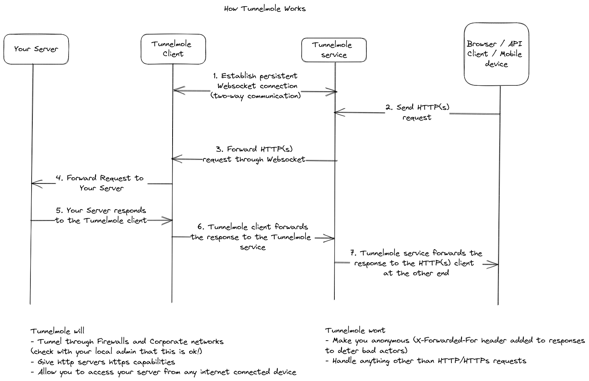

## Tunnelmole
Tunnelmole is a simple tool to give your locally running HTTP(s) servers a public URL. For example, you could get a public URL for
- A web server
- A Docker container
- An API
- A React or node application
- A static website

So, you could have your application running locally on port `8080`, then by running `tmole 8080` you could have a URL such as `https://df34.tunnelmole.com` routing to your locally running application.

Tunnelmole has been compared to a similar tool known as `ngrok`, but is open source.

If you are using the default configuration you will get a HTTPs URL for free.

Heres what you could do with your new public URL
- Automate your life. With a public URL, IFTTT and other automation services can send you webhooks which your code can then react to
- Test and debug webhooks locally without stubbing requests. Set a breakpoint, then trigger the webhook provider to hit your URL
- Use your phone to test the mobile version of your site. A real device will always be better than using an emulator or devtools to do mobile testing
- Test advanced HTTPs only features such as Web Notifications and PWA's locally
- Cross device testing with real devices. Hop on another computer or device running the same or a different OS, then hit the public URL Tunnelmole generated for you
- Share it with anyone over the internet such as a friend, colleague or client to show off your work

### Installation
Install Tunnelmole by running
`npm install -g tunnelmole`

#### Using Tunnelmole
- Start your web application locally and note down the port number its listening on
- Run `tmole <port number>`, replacing `<port number>` with your applications port number. For example, if your application listens on port `8080`, run `tmole 8080`.

Here's what it should look like
```
$ tmole 8080
http://evgtkh-ip-49-145-166-122.tunnelmole.com is forwarding to localhost:8080
https://evgtkh-ip-49-145-166-122.tunnelmole.com is forwarding to localhost:8080
```

Now, just go to either one of the URLs shown with your web browser.
The URLs are public - this means you can also share them with collaborators and others over the internet.

#### Custom subdomain
Sometimes, it can be useful to have a domain that does not change frequently. To use a custom subdoman run
`tmole 8080 as <yourdomain>.tunnelmole.com`.

If you are using the hosted service (which is the default) and you want to use a custom subdomain you'll need to purchase a subscription [Learn More](https://dashboard.tunnelmole.com?utm_source=tunnelmoleClientNPM).

Otherwise, you can self host. To learn more go to the [Tunnelmole Service](https://github.com/robbie-cahill/tunnelmole-service/) GitHub repo.
### Using Tunnelmole as a dependency in your code

#### Add the dependency
Add Tunnelmole as a dependency with
```
npm install --save tunnelmole
```

#### Starting tunnelmole using code
First import `tunnelmole`. Both ES and CommonJS modules are supported.

Importing `tunnelmole` as an ES module
```javascript
import { tunnelmole } from 'tunnelmole';
```

Importing `tunnelmole` as a CommonJS module
```javascript
const tunnelmole = require('tunnelmole/cjs');
```

Once the module is imported you can start tunnelmole with the code below, changing port 3000 to the port your application listens on if it is different.
```javascript
tunnelmole({
    port: 3000
});
```

Tunnelmole will start in the background and you'll see output in the console log similar to the Tunnelmole command line application which will include the public URLs that now point to your application. The function is `async` and won't block execution of the rest of your code.

If you want to use a custom subdomain, you could also pass the domain as an option.
```javascript
tunnelmole({
    port: 3000,
    domain: '<your tunnelmole domain e.g. mysite.tunnelmole.com>'
});
```

Again if you are using the hosted service (which is the default) and you want to use a custom subdomain you'll need to purchase a subscription [Learn More](https://dashboard.tunnelmole.com?utm_source=tunnelmoleClientNPM).

Otherwise, you can self host. To learn more about this option go to the [Tunnelmole Service](https://github.com/robbie-cahill/tunnelmole-service/) GitHub repo.

#### Using Tunnelmole with NPM scripts
Installing Tunnelmole as an NPM dependency will make the following executables available in your project:
```
node_modules/.bin/tmole
node_modules/.bin/tunnelmole
```

They both work identically to the Tunnelmole command line application.

You can run them manually in the same way as the command line application (for example `node node_modules/.bin/tmole 3000`), but its far more convenient to integrate them with NPM scripts in `package.json`. This way, you can automate starting your application and generating a public URL with a single command. For example:
```json
{
    "name": "myapp",
    "version": "0.0.1",
    "scripts": {
        "start": "dist/index.js",
        "start-public": "npm run start && tmole 3000"
    }
}
```

In this example, `npm run start-public` will simultaneously start your application and get tunnelmole to generate public URLs tunneling to port 3000. Replace port 3000 with the port your application listens on if it is different. You will see the public URLs in the command line output.

This allows you to start your application and get a public URL with a single command, instead of needing to run two commands in separate terminals.

### How it works


#### More information
To get more info on hacking Tunnelmole as well as debugging, contributing and more view the full [README](https://github.com/robbie-cahill/tunnelmole-client) on GitHub.

This package is for the Tunnelmole client. The service is also open source and its possible to self host. Get the code at (https://github.com/robbie-cahill/tunnelmole-service/).